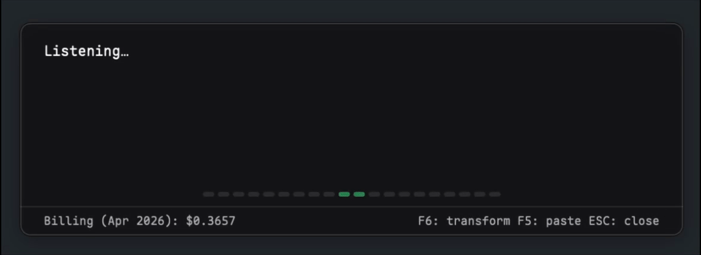

# simple-ptt



A fast, minimal push-to-talk app for macOS with live Deepgram transcription and optional LLM cleanup before paste.

`simple-ptt` is intentionally small: menu bar app, global hotkey, live on-screen transcript, fast paste into the currently focused app. In normal use it aims to stay around **35 MB of RAM**. The goal is not to be feature-rich. The goal is to stay fast, understandable, and out of the way.

## Quick start

> [!IMPORTANT]
> The bundled app is ad-hoc signed but **not notarized**. macOS will block it on first launch, run this to fix:
>
> ```bash
> xattr -dr com.apple.quarantine /Applications/simple-ptt.app
> ```

Expect the usual macOS prompts for: **Microphone** and **Accessibility** for the global hotkey and synthetic paste workflow.

## Deepgram Costs

Deepgram usage for this kind of developer push-to-talk workflow is usually cheap. A full workday typically lands around **$0.50 USD** in transcription cost. Actual cost depends on how long you dictate, which Deepgram plan you are on, which model you use, and Deepgram's current pricing. Check the official [Deepgram pricing page](https://deepgram.com/pricing) before treating that number as current.

## How it works

### Data flow

- Audio is streamed to **Deepgram** for transcription.
- If transformation is enabled, buffered transcript text is sent to your configured LLM provider.

### Default workflow

- Press the record hotkey (`F5` by default) to start listening.
- Speak and watch the live transcript overlay update in real time.
- Stop recording to paste the buffered text into the focused app.
- If transformation is configured and enabled, the app can clean up the transcript before pasting.

### Additional controls

- **Tap vs hold:** short press behaves like toggle; holding past `mic.hold_ms` turns the same hotkey into hold-to-talk.
- **Editable overlay:** You can click into the overlay at any time to manually type, fix, or delete words before pasting.
- **Correction key (`LeftMeta`, shown as `Cmd`, by default):** hold the configured correction key during dictation or while a buffered annotation is visible, speak a correction request, then release the key to apply that correction to the current annotation.
- **Transform hotkey (`F6` by default):** transform the current transcript without auto-pasting it. If you press `F6` while dictating, you can keep talking — your audio is buffered and will seamlessly append to the transformed text once the LLM finishes.
- **Resume dictation:** If you have transformed text (or manually stopped recording), pressing `F5` again will seamlessly resume dictating onto the end of your existing text.
- **`Escape`:** abort recording, cancel background work, or discard a ready buffer.
- **`Cmd+V` while recording:** splice the current plain-text clipboard contents into the active transcript.


## Features

### LLM text transformation
Simple PTT can optionally send your dictation through an LLM to remove filler words, correct punctuation, and format technical terms before pasting.

### Deepgram Keyterms
You can specify custom `keyterms` in the configuration to boost the transcription accuracy for specific vocabulary like product names, technical jargon, or acronyms.

## Configuration

`simple-ptt` looks for config in this order:

1. `SIMPLE_PTT_CONFIG`
2. `$XDG_CONFIG_HOME/simple-ptt/config.toml`
3. `~/.config/simple-ptt/config.toml`

If no config file is found, defaults are used where possible and the app opens **Settings** so you can create one. For normal app launches, `~/.config/simple-ptt/config.toml` is the correct default.

The correction interrupt is configured separately from the record and transform hotkeys via `ui.correction_key`. This must be a single specific key such as `LeftMeta`, `RightMeta`, `LeftAlt`, or `F7`, and it must not overlap with the record or transform triggers.

Transformation now has two separate prompts:

- `transformation.system_prompt` for normal cleanup or rewrite of dictated text.
- `transformation.correction_system_prompt` for correction mode, where the model receives both the current annotation and the spoken correction request.

### Minimal config

If you prefer to edit the file by hand, this is enough to get transcription working. See [`config.example.toml`](./config.example.toml) for all available options.

```toml
[deepgram]
api_key = "YOUR_DEEPGRAM_API_KEY"
```

## Development

For the checked-in development config in this repository:

```bash
just run
```

Useful helper targets:

```bash
just run-config path/to/config.toml
just run-xdg
just bundle-release
just bundle-dmg
just install-app
just start
just list-devices
```

## License

MIT. See [LICENSE](./LICENSE).
