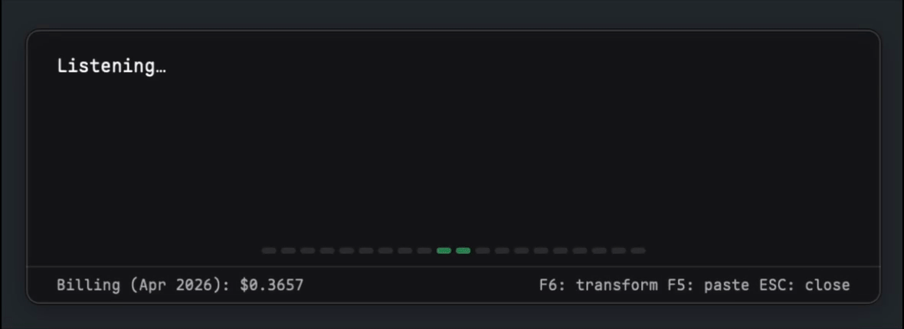

# simple-ptt



A fast, minimal push-to-talk app for macOS with live Deepgram transcription and optional LLM cleanup before paste.

`simple-ptt` is intentionally small: menu bar app, global hotkey, live on-screen transcript, fast paste into the currently focused app. In normal use it aims to stay around **35 MB of RAM**. The goal is not to be feature-rich. The goal is to stay fast, understandable, and out of the way.

## Quick start

> [!IMPORTANT]
> The bundled app is ad-hoc signed but **not notarized**. macOS will block it on first launch, run this to fix:
>
> ```bash
> xattr -dr com.apple.quarantine /Applications/simple-ptt.app
> ```

`simple-ptt` requires macOS 26 or later on Apple Silicon.

Expect the usual macOS prompts for: **Microphone** and **Accessibility** for the global hotkey and synthetic paste workflow.

## Deepgram Costs

Deepgram usage for this kind of developer push-to-talk workflow is usually cheap. As a rough example, **10 hours of speech-to-text should cost less than $5 USD**, which covers close to a month of personal usage for this workflow. Actual cost depends on how long you dictate, which Deepgram plan you are on, which model you use, and Deepgram's current pricing. Check the official [Deepgram pricing page](https://deepgram.com/pricing) before treating that number as current.

## How it works

### Data flow

- Audio is streamed to **Deepgram** for transcription.
- If transformation is enabled, buffered transcript text is sent to your configured LLM provider.

### Default workflow

- Press the record hotkey (`F5` by default) to start listening.
- Speak and watch the live transcript overlay update in real time. Words Deepgram may still revise appear dimmed and turn to full contrast once final.
- Stop recording to paste the buffered text into the focused app.
- If transformation is configured and enabled, the app can clean up the transcript before pasting.

### Additional controls

- **Tap vs hold:** short press behaves like toggle; holding past `mic.hold_ms` turns the same hotkey into hold-to-talk.
- **Editable overlay:** You can click into the overlay at any time to manually type, fix, or delete words before pasting.
- **Overlay look:** the overlay is dark-tinted clear Liquid Glass on a soft blur of the screen around it, and it pops in when it opens and out when it closes. The text switches between light and dark to stay readable against the glass. Below the transcript, a centred row of bars shows the live spectrum of your voice, low pitches on the left and high on the right, each bar growing up and down from the middle as its pitches get louder and gliding between heights (**Meter style** in Settings > General, `ui.meter_style` in the config). Each pitch band learns the room's background noise, so the room stays quiet and the row is empty while you are silent, and the bars scale to how loudly you speak above that noise, so soft speech in a quiet office fills them as well as loud speech. While the transformation model rewrites the text, a light sweeps across it; errors show in red. A correction request appears above the transcript as the glass grows upward to hold it, and the glass shrinks back once the correction is applied. With Reduce Motion on, the overlay fades in and out, the correction appears and disappears in place, the sweep is skipped, and the bars jump to their heights instead of gliding.
- **Correction key (`LeftMeta`, shown as `Cmd`, by default):** hold the configured correction key during dictation or while a buffered annotation is visible, speak a correction request, then release the key to apply that correction to the current annotation. During dictation, recording carries on while the correction is applied, so you can keep talking and the meter keeps running; what you say joins the corrected text.
- **Transform hotkey (`F6` by default):** transform the current transcript without auto-pasting it. If you press `F6` while dictating, you can keep talking — recording carries on and the meter keeps running while the LLM works, and what you say is appended to the transformed text once it finishes.
- **Resume dictation:** If you have transformed text (or manually stopped recording), pressing `F5` again will seamlessly resume dictating onto the end of your existing text.
- **`Escape`:** abort recording, cancel background work, or discard a ready buffer.
- **`Cmd+V` while recording:** splice the current plain-text clipboard contents into the active transcript.

### Microphones and Instant Recording

To make sure your voice is captured the exact millisecond you press the hotkey, `simple-ptt` keeps your microphone "warm" and ready in the background. 

Starting up a microphone in macOS normally takes about a quarter of a second, which would cut off the first word or two of your dictation. Keeping it warm ensures a zero-delay experience at a tiny trade-off of around 1.0% to 1.5% CPU usage when the app is idle. To save that idle CPU at the cost of the startup delay, clear **Keep microphone connection open** in Settings > Microphone (`mic.always_on = false`); the microphone stream is then paused except while you record or while the Settings window is open.

Additionally, the app automatically and instantly detects when you switch your default system microphone (like plugging in USB headphones or connecting AirPods) without using any heavy background polling or lagging your system.

If the microphone in use disconnects, `simple-ptt` switches to the Mac's built-in microphone and stays on it until the system default input changes again (for example, when the disconnected device reconnects). A microphone named in `mic.audio_device` is used whenever it is connected, with the built-in microphone standing in while it is not. If it disconnects mid-recording, the overlay says so, and the record shortcut continues on the new microphone. With no microphone connected at all, the record shortcut shows the overlay with a message saying so instead of recording.


## Features

### LLM text transformation
Simple PTT can optionally send your dictation through an LLM to remove filler words, correct punctuation, and format technical terms before pasting.

### Deepgram Keyterms
You can specify custom `keyterms` in the configuration to boost the transcription accuracy for specific vocabulary like product names, technical jargon, or acronyms.

## Configuration

`simple-ptt` looks for config in this order:

1. `SIMPLE_PTT_CONFIG`
2. `$XDG_CONFIG_HOME/simple-ptt/config.toml`
3. `~/.config/simple-ptt/config.toml`

If no config file is found, defaults are used where possible and the app opens **Settings** so you can create one. For normal app launches, `~/.config/simple-ptt/config.toml` is the correct default.

**Settings** groups the options into toolbar panes: **General** (record and correction shortcuts, overlay font and meter, updates, start on login), **Microphone** (input device, sample rate, gain in dB with a live meter, silence pad, keep microphone connection open), **Deepgram** (API key, language, keyterms, model, endpointing, utterance end), and **Transformation** (transform shortcut, auto-transform, provider, API key, model, and editors for the dictation and correction prompts, which are sent only to the transformation model). Choosing a transformation provider fills the model list from the model cache (`transformation-models.toml` in `$XDG_CACHE_HOME/simple-ptt`, by default `~/.cache/simple-ptt`), or fetches the provider's models when none are cached for that provider and API key. Providers other than Ollama and Hugging Face need their API key, in the field or its environment variable, before their models can be fetched. The API key field is shared by every provider, so a key typed there is sent automatically only when it is the key saved for the selected provider; otherwise enter that provider's key and click **Fetch models**. **Fetch models** reloads the list, and **Check** tests the connection. **Save** writes every pane to the config file. The transformation model and the two prompts are written only when they differ from the built-in defaults, so a config that leaves them out picks up improved defaults in later releases; a key the file already has is kept even when it matches the default. **Reset to Default** above each prompt editor in the Transformation pane puts the built-in prompt back; saving it without further edits removes that prompt from the config file even if the file had it. If the audio input devices can't be listed, or `mic.gain` is outside the slider's 0 to 10 dB range, Settings still loads every pane and explains the problem in its status area; the configured device stays selected, and **Save** writes the gain the slider shows. Settings opens once macOS brings simple-ptt to the front; if you choose **Settings…** and nothing appears, click the simple-ptt icon in the Dock.

The correction interrupt is configured separately from the record and transform hotkeys via `ui.correction_key`. This must be a single specific key such as `LeftMeta`, `RightMeta`, `LeftAlt`, or `F7`, and it must not overlap with the record or transform triggers.

Transformation uses two separate prompts:

- `transformation.system_prompt` for normal cleanup or rewrite of dictated text.
- `transformation.correction_system_prompt` for correction mode, where the model receives both the current annotation and the spoken correction request.

### Minimal config

If you prefer to edit the file by hand, this is enough to get transcription working. See [`config.example.toml`](./config.example.toml) for all available options.

```toml
[deepgram]
api_key = "YOUR_DEEPGRAM_API_KEY"
```

Replace `YOUR_DEEPGRAM_API_KEY` with your Deepgram API key. A non-empty `deepgram.api_key` takes precedence over the `DEEPGRAM_API_KEY` environment variable, which simple-ptt reads only when the key is omitted or empty. Apps opened from Finder or the Dock don't reliably inherit shell environment variables, so keep the key in the config file for normal launches.

## Development

For the repo-local development config (`./config.toml`, gitignored; `just run` creates it from `config.example.toml` when it is missing):

```bash
just run
```

Useful helper targets:

```bash
just run-config path/to/config.toml
just run-xdg
just bundle-release
just bundle-dmg
just install-app
just start
just list-devices
```

## License

MIT. See [LICENSE](./LICENSE).
